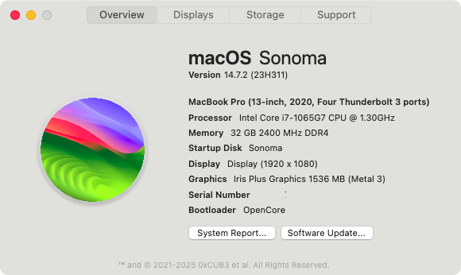
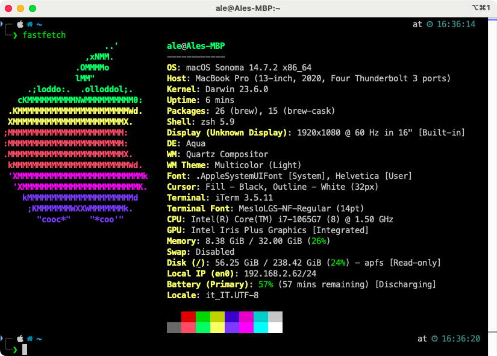
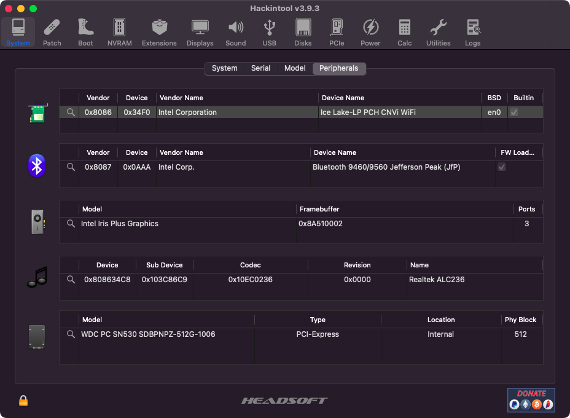
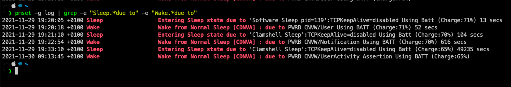

# HP laptop 15s-FQ1034NL Ice Lake - MacBookPro16,2
This repository contains the necessary files and information to successfully boot macOS on this laptop. 

- Bootloader version: **OpenCore 1.0.6**
- SMBIOS: [MacBookPro16,2](https://everymac.com/systems/apple/macbook_pro/specs/macbook-pro-core-i7-2.3-quad-core-13-2020-4-thunderbolt-3-ports-scissor-specs.html)
- Kexts version: everything up-to-date with the latest version (check the links below)
- macOS version: Sonoma, Release channel



<details>
  <summary>fastfetch flex - (RIP neofetch)</summary>




Install `brew` for this, and `brew install neofetch`

</details>


## Specs

| Component      | Brand                                     |
|----------------|-------------------------------------------|
| **CPU**        |  Intel Core i7-1065G7 @ 1.5 GHz           |
| **iGPU**       |  Intel Iris Plus Graphics G7 - Ice Lake   |
| **RAM**        |  32GB SODIMM 2400MHz                      |
| **Storage**    |  WD SN530 512GB                           |
| **Audio**      |  Realtek ALC236 - layout-id 13            |
| **WiFi Card**  |  Intel AX210NGW - 8086:34F0                |
| **BT Card**    |  AX201 Jefferson Peak - 8087:0026         |
| **OS**         |  macOS Sonoma 14.8.1 (23J230)             |
| **BIOS**       |  F42 Rev.A - from .bin 086C8              |
| **Mobo name**  |  HP 86C9                                  |

<details>
  <summary>Pretty PCI overview</summary>




This tool is obtainable [here](https://github.com/benbaker76/Hackintool)
</details>

## Important notes

- In the config.plist, section `PlatformInfo > Generic`, the following fields are currently edited with "CHANGEME" in order to force the user to generate his own serials. Refer to this guide to [know how](https://dortania.github.io/OpenCore-Install-Guide/config-laptop.plist/icelake.html#platforminfo). 
  - `MLB`
  - `ROM`
  - `SystemSerialNumber` 
  - `SystemUUID`

- For those of you who are using a SATA SSD for macOS 11 Big Sur and newer it might be necessary to spoof HP infamous RAID controller `8086:282A` with another ID, a solution can be found [here](https://github.com/1alessandro1/HP-Pavilion-CE2072NL-macOS/blob/a453424ff048b0d15a9b5118d7cf68c1b94dd09c/EFI/OC/config.plist#L471-L477), this is a better alternative and does not require the manual injection of `CtlnaAHCIPort.kext` is not required anymore

- OpenCanopy is fully configured with the correct theme from acidanthera, ([GoldenGate](https://dortania.github.io/OpenCanopy-Gallery/ocbinary.html#set-1-goldengate)) but if you want to disable this you should edit the `config.plist` and change `PickerMode` from `External` to `Builtin` or disable `ShowPicker` entirely.


## How to get this laptop to boot macOS flawlessly

I highly suggest to read the [OpenCore guide](https://dortania.github.io/OpenCore-Install-Guide/).


### ACPI

- For the ACPI configuration which might be the trickiest one, you can use the ones I have in `EFI/OC/ACPI` if you have the same BIOS as mine (e.g. the `HP 14s-dq1013tu` has the same BIOS according to [ferdysopian](https://github.com/ferdysopian/14s-dq1013tu-hackintosh). 

- Special thanks to [dreamwhite](https://github.com/dreamwhite) for his help on fixing the trackpad (`SSDT-TPD0` and `SSDT-GPIO`) and ACPI USB map (`SSDT-USB`) alongside all ACPI hotpatching


### Drivers

Must have to boot any macOS version from USB:

* `HfsPlus.efi` - required for HFS support in UEFI - check [this method](https://dortania.github.io/OpenCore-Install-Guide/installer-guide/mac-install-recovery.html#legacy-macos-online-method) to create the HFS-formatted USB thumb drive 
  <details>
  <summary>Additional backgroud about the origins of this driver</summary>
  
  This driver can be found either in the `EFI/OC/Drivers` folder of this repository, in [acidanthera/OcBinaryData](https://github.com/acidanthera/OcBinaryData/master/Drivers/HfsPlus.efi) or [here](https://github.com/macos86/Estrazione-driver.efi-da-installer) if you want to extract it youself
  
  </details>
  
* `OpenRuntime.efi` - (bundled in OpenCore package)
* `ResetNvramEntry.efi`  - (bundled in OpenCore package) to add NVRAM reset functionality.


Additional drivers for cosmetic stuff:

* `AudioDxe.efi` - for Boot Chime support in UEFI environment (already enabled)
* `OpenCanopy.efi` (bundled in OpenCore package) for Mac-like GUI support in picker


### Kexts

* [AirportItlwm](https://github.com/OpenIntelwireless/itlwm/releases/latest)
* [AppleALC](https://github.com/acidanthera/AppleALC/releases/latest)
* [CPUFriend](https://github.com/acidanthera/CPUFriend/releases/latest) - SSDT-PLUG is already configured with the frequency data
* [HoRNDIS](https://github.com/jwise/HoRNDIS/releases/latest) - for those of you who like to have USB tethering support on Android devices
* [BluetoolFixup](https://github.com/acidanthera/BrcmPatchRAM/releases/latest)
* [IntelBluetoothFirmware](https://github.com/OpenIntelWireless/IntelBluetoothFirmware/releases/latest) 
* [Lilu](https://github.com/acidanthera/Lilu/releases/latest)
* [NVMeFix](https://github.com/acidanthera/NVMeFix/releases/latest)
* [SMCBatteryManager](https://github.com/acidanthera/VirtualSMC/releases/latest) - shipped inside **VirtualSMC**
* [SMCProcessor](https://github.com/acidanthera/VirtualSMC/releases/latest) - shipped inside **VirtualSMC**
* [VirtualSMC](https://github.com/acidanthera/VirtualSMC/releases/latest) 
* [VoodooPS2Controller](https://github.com/acidanthera/VoodooPS2/releases/latest) - bundled with **VoodooPS2Keyboard.kext** (remove the others)
* [VoodooI2C](https://github.com/VoodooI2C/VoodooI2C/releases/latest) bundled with **VoodooInput**, **VoodooGPIO.kext** and **VoodooI2CServices.kext**
* [VoodooI2CHID](https://github.com/VoodooI2C/VoodooI2CHID)
* [WhateverGreen](https://github.com/acidanthera/WhateverGreen/releases/latest)

### BIOS offsets (F21 / and F23 / F25 / F36 / F42 are unchanged)
 
 **Note**: The BIOSes present in the directory `Misc/Extracted\ sp132835/` are multiple bin files, and the one made for this laptop is precisely [this one](https://github.com/1alessandro1/HP-laptop-15s-fq1034nl-ice-lake/blob/main/Misc/BIOS/BIOS_F.23_HP_086C9/Extracted%20sp135993/086C8.bin)
 
 Please note that even though I've listed here the offsets with `setup_var` (as `modgrubshell.efi` would require) I had to use `RU.efi` to edit these. A nice guide on how to use `RU.efi` can be found [here](https://www.macos86.it/topic/4523-guida-come-modificare-le-impostazioni-nascoste-del-bios-su-pc-con-firmware-uefi/)
 
 
- **CFG Lock** = `setup_var 0x43 0x0` (Disabled) (Section `CpuSetup`)
 
- **DVMT Pre-Allocated** = `setup_var 0xA4 0x2` (64MB) (or `0x4` for 128MB) (Section `SaSetup`)
 
- **DVMT Total Gfx Mem** = `setup_var 0xA5 0x3` (MAX) (Section `SaSetup`)
 
- **SATA Controller(s)** = `setup_var 0x5B 0x1` (Enabled) - if you have the cable inside (Section `Setup`)
 
- **SATA Mode** = `setup_var 0x5C 0x0` (AHCI) - this should be on zero by default (Section `Setup`)

- **GPIO Interrupt** = `setup_var 0x2CA 0x0` (Section `Setup`)

You can use RU.efi or setup_var.efi to configure these settings. Check this utility who was born from [datasone](https://github.com/datasone)'s hard work to unlock them all by loading `OpenShell.efi` from F9 menu (present in `EFI/OC/Tools` alongside `setup_var.efi` and `RU.efi`)


<details>
  <summary>Commands to run with setup_var.efi</summary>

  
  
  Note: these commands are only available in UEFI shell and the tool can be found [here](https://github.com/datasone/setup_var.efi)
  
  ```bash
  setup_var.efi 0x43 0x0 -n CpuSetup # CFG Lock disabled
  setup_var.efi 0xA4 0x2 -n SaSetup # DVMT Pre-Allocated to 64MB
  setup_var.efi 0xA5 0x3 -n SaSetup # (MAX)
  setup_var.efi 0x2CA 0x0 -n Setup # Trackpad GPIO mode
  ```
</details>

This way, if you applied these settings correctly either with RU.efi or setup_var.efi:

- You won't need `framebuffer-fbmem` and `framebuffer-stolenmem` properties under `DeviceProperties` for the graphics patch
- You won't need `AppleXCPMCfgLock` or similar kernel quirks

 ### AAPL,ig-platform-id choice

~~Unfortunately even after setting the DVMT Pre-Allocated value to 160MB (05) value in BIOS, the cursor problem persists, and from WhateverGreen's DEBUG logs I still can see that it is fixed to 60MB.~~ FIXED
 
The problem above was in the fact that I was editing the wrong section, `Setup` (VarStoreId: 0x1)  instead of `SaSetup` (VarStoreId: 0x16) hence my changes where vain. Now as you can see from the screenshot below, I can set 128MB with no issues


 The values I've tested to get the display to be functional after sleep are:

| AAPL,ig-platform-id |   device-id                                 | Issues                                                                                   |
| ------------------- | --------------------------------------------| ---------------------------------------------------------------------------------------- |
|                     |                                             |                                                                                          |
| `0200518A`          | `528A0000` (default from WeG)               | IN USE cursor problem fixed after understanding that I had to edit `SaSetup` with `RU.efi` | 
| `01005C8A`          | `528A0000` (default from WeG) | NOT in USE anymore - No cursor problem with stolenmem set to the highest possible value I can (59MB)   |
| `0200538A`          | `538A0000`                                  | Black screen right after booting                                                         |
| `0000528A`          | `528A0000` (default from WeG)               | Black screen after sleep/wake cycle                                                      |

### Sleep

Remember that you are recommended to apply these settings once you booted macOS:

```
sudo pmset autopoweroff 0
sudo pmset powernap 0
sudo pmset standby 0
sudo pmset proximitywake 0
sudo pmset tcpkeepalive 0
```
You can keep `tcpkeepalive` on, but you might experience a litte bit more discharge than usual when putting your laptop to sleep overnight (7-8% instead of 3-5%) but you have the possibility to recieve notifications/updates every 2 hours since the laptop will wake to check them if `tcpkeepalive` is set to `1`



## Brightness keys 

There is a simple `SSDT-PS2.aml` that works with the `_Q10` and `_Q11` rename which adds the correct `Notify` parameters to handle screen brightness while pressing `F2` or `F3`. Please note that `SSDT-PNLFCFL.aml` is reqired too.

## Memory Attributes Table (MAT) support is present

Hence, the only `Booter > Quirks` required to boot are `AvoidRuntimeDefrag`, `RebuildAppleMemoryMap`, `SyncRuntimePermissions` and `SetupVirtualMap`.


`MMIO` Devirtualization is not required.

## Trackpad and Gestures

With this laptop, HP went with a trackpad on the ACPI path `\_SB.PCI0.I2C1.TPD0` with the name `ELAN0712`, but actually it's an HID device. `VoodooI2C.kext` and `VoodooI2CHID.kext` successfully handle all the native gestures. Everything is working, even the 4-fingers gestures.

Please note that in order for the trackpad to work properly, you should set it in `GPIO Interrupt` in the BIOS and not `APIC Interrupt` (default)

## USB Mapping

With the help of [dreamwhite](https://github.com/dreamwhite) we found a clever way to map usb ports present in the `DSDT` without having to drop tables or having to load `SSDT-RHUB.aml`:  in addition, I found from [this useful list](https://github.com/m0d16l14n1/icelake-hackintosh#usb-tb-and-video-output-related-issues-and-wa) that many people had problems mapping USB ports (in my case, even if SSDT-5 from SysReport contains a dedicated USB table, blocking it and loading the customized one does not work since macOS will look at the ports defined in the DSDT instead). So the XUPC solved us all of this trouble and I'm perfectly fine with it.


Basically by hot patching the `_UPC` method to `XUPC` we managed to define that method in an external `SSDT-USB.aml`.

### Wi-Fi speed with AirportItlwm and sleep

On WiFi support, **do not use the BCM94360NG** because makes macOS freeze randomly. This happened on multiple recent IceLake laptops. I've tested multiple cards and it seems that there is a very strict BIOS whitelist on what card is allowed to be used on this laptop. Intel 8260 (`8086:24f3`) was in use before, but with that one I couldn't get bluetooth support since these new IceLake laptops might expect CNViO cards like the Intel 9560NGW (`8086:34F0`)

A special thanks to [ferdysopian](https://github.com/ferdysopian) for his help on fixing RFKILL enabled on macOS, see [this thread](https://github.com/OpenIntelWireless/itlwm/issues/845) for more information.


## Credits

* [Apple](https://apple.com) for macOS
* [Acidanthera](https://github.com/Acidanthera) for OpenCore and Lilu-based kexts 
* [dreamwhite](https://github.com/dreamwhite) for helping me to fix the I2C trackpad and with SSDT/ACPI hotpatching
* [ferdysopian](https://github.com/ferdysopian) for supporting me with WiFi RFKILL issues
* [Gengik84](https://www.macos86.it/profile/1-gengik84/) for introducing us the `GENG` method used in SSDT-USB.aml
* [dortania](https://github.com/dortania) team for its detailed guides
* [Corpnewt](https://github.com/CorpNewt) for SSDTTime and [fewtarius](https://github.com/fewtarius) for CPUFriend fork (now merged into Corp's repo)
* [m0d16l14n1](https://github.com/m0d16l14n1/) for providing a [reference](https://github.com/m0d16l14n1/icelake-hackintosh) to all Ice Lake issues

[](https://app.repohistory.com/star-history)
