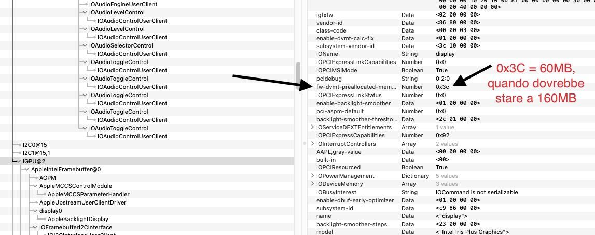

# HP 15s-FQ1034NL
This repository contains the necessary files and information to successfully boot macOS on this laptop. 

 ### BIOS offsets (F21)
 
- **CFG Lock** = setup_var 0x43 0x0 (Disabled)
 
- **DVMT Pre-Allocated** = setup_var 0xA4 0x5 (160MB)
 
- **DVMT Total Gfx Mem** = setup_var 0xA5 0x3 (MAX)
 
- **SATA Controller(s)** = 0x5B 0x1 (Enabled) - if you have the cable inside
 
- **SATA Mode** = setup_var 0x5C 0x0 (AHCI) - this should be on zero by default

- **GPIO Interrupt** = setup_var 0x2CA 0x0

 ### AAPL,ig-platform-id choice

Unfortunately even after setting the DVMT Pre-Allocated value to 160MB (05) value in BIOS, the cursor problem persists, and from WhateverGreen's DEBUG logs I still can see that it is fixed to 60MB.

 It works with:
 - platform-id = 0200518A and default device-id = 528A0000 (but there's the cursor problem even with stolenmem set to 00003001 = 19MB or 0000B003 = 59MB)
 - platform-id = 01005C8A and device-id = 528A0000

### Wi-Fi speed with AirportItlwm and sleep

For compatibility reasons, I chose to use the Intel 8260ac Wireless wifi card 8086:24f3. In order to get the maximum performance, even though when using the recognized country code (IT) it shows 867Mbit (433 x 2 NSS) it actually barely reaches 30Mbit after a sleep wake cycle. 

The workaround for this issue is to disconnect and reconnect to your Wi-Fi network, and the speeds will come back to default (70-75MB) even with the correctly recognized country code (`IT` in my case)

