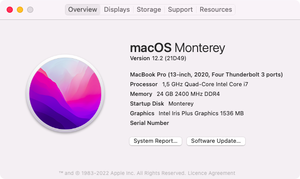
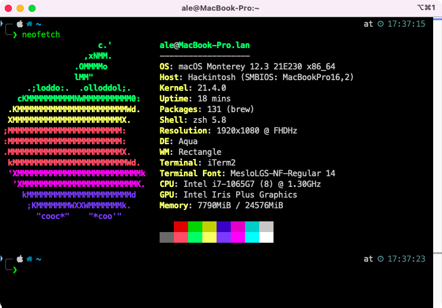
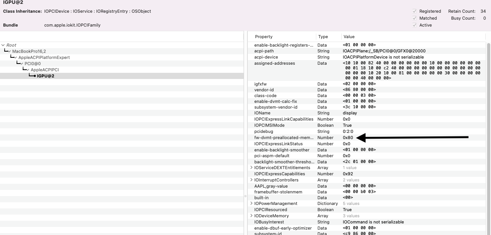

# HP laptop 15s-FQ1034NL Ice Lake - MacBookPro16,2
This repository contains the necessary files and information to successfully boot macOS on this laptop. 

- Bootloader version: **OpenCore 0.7.9**
- SMBIOS: [MacBookPro16,2](https://everymac.com/systems/apple/macbook_pro/specs/macbook-pro-core-i7-2.3-quad-core-13-2020-4-thunderbolt-3-ports-scissor-specs.html)
- Kexts version: everything up-to-date with the latest version (check the links below)
- macOS version: [Monterey](https://www.apple.com/macos/monterey) - Release channel





## Specs

| Component      | Brand                                     |
|----------------|-------------------------------------------|
| **CPU**        | `Intel Core i7-1065G7 @ 1.5 GHz`          |
| **iGPU**       | `Intel Iris Plus Graphics G7 - Ice Lake`  |
| **Storage**    | `WD SN530 512GB`                          |
| **Audio**      | `Realtek ALC236 - layout 13`              |
| **WiFi Card**  | `Intel 8260ac - 8086:24f3`                |
| **OS**         | `macOS Monterey 12.3 (21E230)`            |
| **BIOS**       | `F23 Rev.A - from .bin 086C8`             |


## Important notes

- In the config.plist, section `PlatformInfo > Generic`, the following fields are currently edited with "CHANGEME" in order to force the user to generate his own serials. Refer to this guide to [know how](https://dortania.github.io/OpenCore-Install-Guide/config-laptop.plist/icelake.html#platforminfo). 
  - `MLB`
  - `ROM`
  - `SystemSerialNumber` 
  - `SystemUUID`

- For those who have set up a multiboot environment with multiple drives as I did please note vendor-id and device-id `8086:282A` have to be spoofed on the `PciRoot(0x0)/Pci(0x17,0x0)` address hence `CtlnaAHCIPort.kext` is not required anymore

- OpenCanopy is fully configured with the correct theme from acidanthera, ([GoldenGate](https://dortania.github.io/OpenCanopy-Gallery/ocbinary.html#set-1-goldengate)) but if you want to disable this you should edit the `config.plist` and change `PickerMode` from `External` to `Builtin` or disable `ShowPicker` entirely.


## How to get this laptop to boot macOS flawlessly

I highly suggest to read the [OpenCore guide](https://dortania.github.io/OpenCore-Install-Guide/)

**Note**: For the ACPI configuration which might be the trickiest one, you can use the ones I have in `OC/ACPI`. Special thanks to [dreamwhite](https://github.com/dreamwhite) for his help with SSDTs and ACPI hotpatching with OpenCore.


### Drivers

Must have to boot any macOS version from USB:

* OpenRuntime.efi (bundled in OpenCore package)
* HfsPlus.efi (if you created the USB with [this method](https://dortania.github.io/OpenCore-Install-Guide/installer-guide/mac-install-recovery.html#legacy-macos-online-method) or with `createinstallmedia`) and can be found either in the `OC/Drivers` folder of this repository or in [acidanthera/OcBinaryData](https://github.com/acidanthera/OcBinaryData/blob/master/Drivers/HfsPlus.efi)

Additional drivers for cosmetic stuff:

* AudioDxe.efi for Boot Chime support in UEFI environment (already enabled)
* OpenCanopy.efi (bundled in OpenCore package) for Mac-like GUI support in picker

### Kexts

* [AppleALC](https://github.com/acidanthera/AppleALC/releases/latest)
* [CPUFriend](https://github.com/acidanthera/CPUFriend/releases/latest) - SSDT-PLUG is already configured with the frequency data
* [HoRNDIS](https://github.com/jwise/HoRNDIS/releases/latest) - for those of you who like to have USB tethering support
* [Lilu](https://github.com/acidanthera/Lilu/releases/latest)
* [NVMeFix](https://github.com/acidanthera/NVMeFix/releases/latest)
* [SMCBatteryManager](https://github.com/acidanthera/VirtualSMC/releases/latest) - shipped inside **VirtualSMC**
* [SMCProcessor](https://github.com/acidanthera/VirtualSMC/releases/latest) - shipped inside **VirtualSMC**
* [VirtualSMC](https://github.com/acidanthera/VirtualSMC/releases/latest) 
* [VoodooPS2Controller](https://github.com/acidanthera/VoodooPS2/releases/latest) - bundled with **VoodooPS2Keyboard.kext** (remove the others)
* [VoodooI2C](https://github.com/VoodooI2C/VoodooI2C/releases/latest) bundled with **VoodooInput**, **VoodooGPIO.kext** and **VoodooI2CServices.kext**
* [VoodooI2CHID](https://github.com/VoodooI2C/VoodooI2CHID)
* [WhateverGreen](https://github.com/acidanthera/WhateverGreen/releases/latest)

 ### BIOS offsets (F21 Rev. A and F23 Rev. A are unchanged)
 
 **Note**: The BIOSes present in the directory `Misc/Extracted\ sp132835/` are multiple bin files, and the one made for this laptop is precisely [this one](https://github.com/1alessandro1/HP-laptop-15s-fq1034nl-ice-lake/blob/main/Misc/Extracted%20sp132835/086C8.bin)
 
 Please note that even though I've listed here the offsets with `setup_var` (as `modgrubshell.efi` would require) I had to use `RU.efi` to edit these. A nice guide on how to use `RU.efi` can be found [here](https://www.macos86.it/topic/4523-guida-come-modificare-le-impostazioni-nascoste-del-bios-su-pc-con-firmware-uefi/)
 
 
- **CFG Lock** = `setup_var 0x43 0x0` (Disabled) (Section `CpuSetup`)
 
- **DVMT Pre-Allocated** = `setup_var 0xA4 0x2` (64MB) (or `0x4` for 128MB) (Section `SaSetup`)
 
- **DVMT Total Gfx Mem** = `setup_var 0xA5 0x3` (MAX) (Section `SaSetup`)
 
- **SATA Controller(s)** = `setup_var 0x5B 0x1` (Enabled) - if you have the cable inside (Section `Setup`)
 
- **SATA Mode** = `setup_var 0x5C 0x0` (AHCI) - this should be on zero by default (Section `Setup`)

- **GPIO Interrupt** = `setup_var 0x2CA 0x0` (Section `Setup`)

This way, if you applied these settings correctly: 
- You won't need `framebuffer-fbmem` and `framebuffer-stolenmem` properties under `DeviceProperties` for the graphics patch
- You won't need `AppleXCPMCfgLock` or similar kernel quirks

 ### AAPL,ig-platform-id choice and Sleep

~~Unfortunately even after setting the DVMT Pre-Allocated value to 160MB (05) value in BIOS, the cursor problem persists, and from WhateverGreen's DEBUG logs I still can see that it is fixed to 60MB.~~ FIXED
 
The problem above was in the fact that I was editing the wrong section, `Setup` (VarStoreId: 0x1)  instead of `SaSetup` (VarStoreId: 0x16) hence my changes where vain. Now as you can see from the screenshot below, I can set 128MB with no issues



 The values I've tested to get the display to be functional after sleep are:

| AAPL,ig-platform-id |   device-id                                 | Issues                                                                                   |
| ------------------- | --------------------------------------------| ---------------------------------------------------------------------------------------- |
|                     |                                             |                                                                                          |
| `0200518A`          | `528A0000` (default from WeG)               | IN USE cursor problem fixed after understanding that I had to edid `SaSetup` with `RU.efi` | 
| `01005C8A`          | `528A0000` (default from WeG) | NOT in USE anymore - No cursor problem with stolenmem set to the highest possible value I can (59MB)   |
| `0200538A`          | `538A0000`                                  | Black screen right after booting                                                         |
| `0000528A`          | `528A0000` (default from WeG)               | Black screen after sleep/wake cycle                                                      |

Remember that you are recommended to apply these settings once you booted macOS:

```
sudo pmset autopoweroff 0
sudo pmset powernap 0
sudo pmset standby 0
sudo pmset proximitywake 0
sudo pmset tcpkeepalive 0
```
You can let `tcpkeepalive` to be on, but you might experience a litte bit more discharge than usual when putting your laptop to sleep overnight (7-8% instead of 3-5%) but you have the possibility to recieve notifications/updates every 2 hours since the laptop will wake to check them if `tcpkeepalive` is set to `1`

## Brightness keys 

There is a simple `SSDT-PS2.aml` that works with the `_Q10` and `_Q11` rename which adds the correct `Notify` parameters to handle screen brightness while pressing `F2` or `F3`. Please note that `SSDT-PNLFCFL.aml` is reqired too.

## `MAT Support` is `1`

Hence, the only `Booter > Quirks` required to boot are `AvoidRuntimeDefrag`, `RebuildAppleMemoryMap`, `SyncRuntimePermissions` and `SetupVirtualMap`.


MMIO Devirtualization it is not required.

## Trackpad and Gestures

With this laptop, HP went with a trackpad on the ACPI path `\_SB.PCI0.I2C1.TPD0` with the name `ELAN0712`, but actually it's an HID device. `VoodooI2C.kext` and `VoodooI2CHID.kext` successfully handle all the native gestures. Everything is working, even the 4-fingers gestures.

Please note that in order for the trackpad to work properly, you should set it in `GPIO Interrupt` in the BIOS and not `APIC Interrupt` (default)

## USB Mapping

With the help of [dreamwhite](https://github.com/dreamwhite) we found a clever way to map usb ports present in the `DSDT` without having to drop tables or having to load `SSDT-RHUB.aml`:  in addition, I found from [this useful list](https://github.com/m0d16l14n1/icelake-hackintosh#usb-tb-and-video-output-related-issues-and-wa) that many people had problems mapping USB ports (in my case, even if SSDT-5 from SysReport contains a dedicated USB table, blocking it and loading the customized one does not work since macOS will look at the ports defined in the DSDT instead). So the XUPC solved us all of this trouble and I'm perfectly fine with it.


Basically by hot patching the `_UPC` method to `XUPC` we managed to define that method in an external `SSDT-USB.aml`.

### Wi-Fi speed with AirportItlwm and sleep

For compatibility reasons, I chose to use the Intel 8260ac Wireless wifi card `8086:24f3`. In order to get the maximum performance, even though when using the recognized country code (`IT`) it shows `867Mbit` (`433 x 2 NSS`) it actually barely reaches 30Mbit after a sleep wake cycle. 

The workaround for this issue is to disconnect and reconnect to your Wi-Fi network, and the speeds will come back to default (70-75MB) even with the correctly recognized country code (`IT` in my case)

## Credits

* [Apple](https://apple.com) for macOS
* [Acidanthera](https://github.com/Acidanthera) for OpenCore and Lilu-based kexts 
* [dreamwhite](https://github.com/dreamwhite) for helping me to fix the I2C trackpad and with SSDT/ACPI hotpatching
* [Gengik84](https://www.macos86.it/profile/1-gengik84/) for the `GENG` method used in `SSDT-USB.aml`
* [dortania](https://github.com/dortania) team for its detailed guides
* [Corpnewt](https://github.com/CorpNewt) for SSDTTime and [fewtarius](https://github.com/fewtarius) for CPUFriend fork (now merged into Corp's repo)
* [m0d16l14n1](https://github.com/m0d16l14n1/) for providing a [reference](https://github.com/m0d16l14n1/icelake-hackintosh) to all Ice Lake issues
